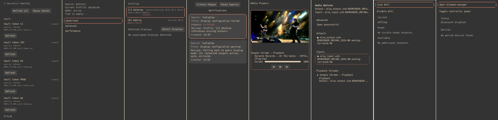
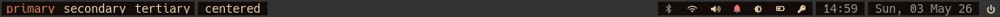
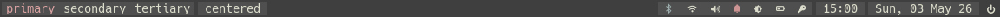
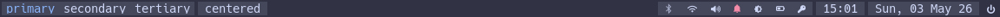
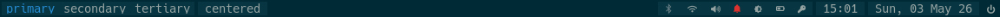
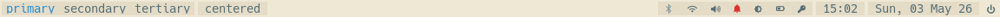
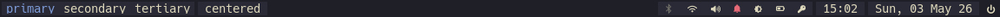
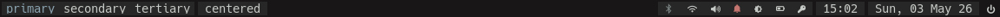
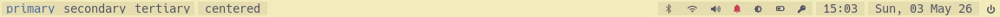

# LynxBurn AwesomeWM Config

This repository contains an AwesomeWM configuration with a small top-level
config surface, a bundled `lynxburn` theme, and a set of local `lx*` modules
for the bar, popups, notifications, media, networking, power, display control,
and launcher behavior.

It is usable as a real daily-driver config, but it is still a personal config
first rather than a polished general-purpose distribution.

## What To Expect

- this repo is actively shaped around one real desktop setup
- the config surface is intended to be reusable, but ongoing refactors and
  feature work can still move things around
- focused bug reports and targeted improvements are welcome
- larger feature ideas should be discussed before implementation
- this is maintained as a real config, not as a product with support guarantees

## Features

- compact top-level `lxbar` with ordered widgets and popup cycling
- shared popup behavior for keyboard navigation, placement, selection, and
  widget feedback
- local modules for media, notifications, network state, Bluetooth, power
  profiles, display control, secret/token health, and app launching
- configurable screen/tag/layout setup with local `centerwork` layouts and
  optional third-party layout registration
- swappable `lynxburn` color schemes and theme-level overrides
- custom bar widgets for simple extras such as IMAP mail, CPU, memory, load,
  filesystem, and systray
- startup preflight checks for missing tools that would otherwise fail quietly

## Screenshots

All popups - right side mode:

[](./screenshots/all_popups_side.jpg)

Color themes:

- lynxburn: [](./screenshots/theme_lynxburn.jpg)
- zenburn: [](./screenshots/theme_zenburn.jpg)
- nord: [](./screenshots/theme_nord.jpg)
- catppuccin: [](./screenshots/theme_catppuccin.jpg)
- solarized_dark: [](./screenshots/theme_solarized_dark.jpg)
- solarized_light: [](./screenshots/theme_solarized_light.jpg)
- kanagawa_wave: [](./screenshots/theme_kanagawa_wave.jpg)
- kanagawa_dragon: [](./screenshots/theme_kanagawa_dragon.jpg)
- kanagawa_lotus: [](./screenshots/theme_kanagawa_lotus.jpg)

## Compatibility

- Tested daily with AwesomeWM 4.3 on X11.
- AwesomeWM 4.4 should work, but is not currently daily-driven here.
- SomeWM 1.4 is supported as an experimental Wayland compatibility target.
  It works well enough to start and test, but it is not yet extensively
  daily-driven. See [`WAYLAND.md`](./WAYLAND.md) for the current status and
  known rough edges.

## Dependencies

Core runtime:

- AwesomeWM
- the Lua libraries shipped with AwesomeWM, including `awful`, `beautiful`,
  `gears`, `naughty`, and `wibox`
- a font with broad glyph coverage for the bar and popup icons, ideally
  something like `Hack Nerd Font Mono`

Common external commands used by the current Awesome/X11 defaults:

- `playerctl`
- `xbacklight` or an equivalent brightness backend if you override it
- `xset`
- `xrandr`
- `scrot`
- `secret-tool` if you use the bundled IMAP custom widget
  To store a secret, use something like this: `secret-tool store --label="AwesomeWM IMAP" service awesomewm-imap account me@example.org`.
  Then configure the IMAP widget like this:
  ```lua
    commands = {
      imap = {
        imap_mail = "me@example.org",
        imap_secret = "secret-tool lookup service awesomewm-imap account me@example.org",
        imap_server = "mail.example.org",
      },
    },
  ```

Common desktop programs referenced by the defaults:

- a terminal emulator
- a file browser
- optional applets or tray tools such as network, Bluetooth, audio, or sync
  applets if you add them to your own setup

This README intentionally does not include distro-specific installation steps
yet.

SomeWM/Wayland defaults use Wayland-native commands where practical:

- `foot`
- `grim`
- `slurp`
- `brightnessctl`
- `wlopm`
- `wlr-randr`
- optional `wl-paste` for lxrunner primary-selection paste

## Startup Preflight

After Awesome has loaded successfully, the config runs a startup preflight pass
for dependencies that would otherwise tend to fail silently or degrade module
behavior in confusing ways.

Current behavior:

- missing tools are grouped by `core` or `lx*` module
- the report is written to stderr, which typically means `~/.xsession-errors`
- the same report is shown as a `naughty` notification
- bar-module checks are only performed for modules currently enabled through
  `lxmodules.lxbar.order`
- shipped screenshot-command dependencies such as `scrot` / `grim` / `slurp` /
  `xdg-open` are only checked when those default commands are still in use
  rather than overridden locally

This is intentionally a concrete binary/command inventory, not a broader
service-health or environment-diagnostics framework.

## Quickstart

The user-facing config entrypoint is top-level `config.lua`.

1. Copy `config.minimal.example.lua` to `config.lua` if you want the smallest
   practical starting point, or copy `config.example.lua` if you want broader
   commented examples.
2. Adjust `commands` so the config points at programs that actually exist on
   your system.
3. Adjust `screens` so monitor indices, tag names, and per-tag layouts match
   your setup.
4. Adjust `lxmodules` to choose bar order, popup cycling participation, and
   module-specific behavior.
5. Adjust `theme` only for appearance-related overrides.

Minimal example:

```lua
theme = {
    wallpaper = os.getenv("HOME") .. "/.wallpaper",
}

commands = {
    terminal = "alacritty",
    filebrowser = "xdg-open",
}

screens = {
    tag_order = { "primary", "secondary", "tertiary" },
    tag_defaults = {
        primary = {
            layout = "fair.horizontal",
            layouts = { "fair.horizontal", "centerwork.horizontal", "floating" },
        },
        secondary = {
            layout = "centerwork",
            layouts = { "centerwork", "fair", "floating" },
        },
        tertiary = {
            layout = "floating",
            layouts = { "floating" },
        },
    },
    center = {
        dpi = 96,
    },
}

lxmodules = {
    lxbar = {
        order = { "lxbluetooth", "lxnetwork", "lxmedia", "lxnotify", "lxdisplay", "lxpower" },
        popup_side = "right",
        modules = {
            lxbluetooth = { cycle = false },
        },
        custom_widgets = {
            systray = require("widgets.systray"),
        },
    },
    lxrunner = {
        width = 640,
        row_count = 10,
    },
}
```

The tracked [`config.minimal.example.lua`](./config.minimal.example.lua) file is
the preferred starter template. The larger [`config.example.lua`](./config.example.lua)
is intentionally more verbose and is better treated as a reference catalog for
available knobs.

Optional third-party layouts can be registered without editing core files:

```lua
layouts = {
    custom = {
        termfair = require("lain").layout.termfair,
        ["cascade.tile"] = require("lain").layout.cascade.tile,
    },
    setup = function()
        local lain = require("lain")
        lain.layout.termfair.nmaster = 3
        lain.layout.termfair.ncol = 1
    end,
}
```

After registration, use those names in `screens.tag_defaults[*].layout` or
`screens.tag_defaults[*].layouts`.

## Configuration Model

The current config layers are:

- `config/defaults.lua`
  Narrow shipped baseline
- `config.minimal.example.lua`
  Small practical starter config for new checkouts
- `config.example.lua`
  Tracked example override file with more opinionated/expanded examples
- `config.lua`
  Your local machine-specific overrides

The main top-level sections are:

- `commands`
- `keys`
- `layouts`
- `lxmodules`
- `rules`
- `screens`
- `settings`
- `theme`

General ownership rules:

- put program/backend choices under `commands`
- put user keybinding overrides under `keys`
- put bar order and popup-cycle participation under `lxmodules.lxbar`
- put simple non-`lx*` in-bar widgets under `lxmodules.lxbar.custom_widgets`
  and reference them from `lxmodules.lxbar.order` as `custom:<name>`
- put module behavior under `lxmodules.<module>`
- put monitor, tag, and layout config under `screens`
- put appearance overrides under `theme`

Dependency and startup-check details for individual modules live in the module
READMEs.

## Modules And Theme

Module-specific usage, feature lists, config knobs, and theme variables live in
their own READMEs.

Core shared pieces:

- [`lxcommon`](./lxcommon/README.md): shared helper layer for popup sessions,
  popup key handling, placement, reusable popup UI rows/cards, widget feedback,
  compact OSDs, and small cross-module utilities
- [`lxbar`](./lxbar/README.md): compact top-level widget bar, popup cycling
  entrypoint, custom widget hosting, and per-screen bar placement

Modules:

- [`lxmedia`](./lxmedia/README.md): audio/media widget for volume, mute,
  microphone state, playback stream controls, device routing, and MPRIS media
  transport
- [`lxnotify`](./lxnotify/README.md): notification store and popup UI with
  grouping, keyboard navigation, dismiss actions, and top-level unread state
- [`lxnetwork`](./lxnetwork/README.md): NetworkManager-oriented network widget
  for Wi-Fi state, scans, VPN state, and connection actions
- [`lxbluetooth`](./lxbluetooth/README.md): Bluetooth widget for adapter power,
  connected device state, device actions, and manager launch integration
- [`lxpower`](./lxpower/README.md): power-profile widget for AC/battery-aware
  profile switching, pinning, and dGPU status display
- [`lxdisplay`](./lxdisplay/README.md): display-control widget for brightness,
  DPMS/display off, redshift-style temperature handling, and backend-specific
  display-profile application
- [`lxsecrets`](./lxsecrets/README.md): secret/token health widget for GitLab
  and Vault refresh flows, expiry display, VPN-gated checks, and login-needed
  attention state
- [`lxrunner`](./lxrunner/README.md): keyboard-first launcher for apps,
  aliases, shell commands, and service-refresh shortcuts

Theme:

- [`lynxburn`](./themes/lynxburn/README.md)

Planned work lives in [`ROADMAP.md`](./ROADMAP.md) plus the corresponding
module/theme `SPEC.md` files.

## Screenshots

- `[placeholder] full desktop overview`
- `[placeholder] lxbar and compact widget row`
- `[placeholder] popup stack and cycling flow`
- `[placeholder] lxrunner`

## Further Docs

- [`SPEC.md`](./SPEC.md): top-level scope and explicit non-goals
- [`ROADMAP.md`](./ROADMAP.md): current implementation backlog and priority order
- [`WAYLAND.md`](./WAYLAND.md): SomeWM/Wayland compatibility notes and known issues
- [`DEVELOPMENT.md`](./DEVELOPMENT.md): internal architecture and extension notes
- [`config.minimal.example.lua`](./config.minimal.example.lua): small starter
  config template
- [`config.example.lua`](./config.example.lua): larger commented config
  reference
- [`CONTRIBUTING.md`](./CONTRIBUTING.md): contribution scope and expectations
- [`CHANGELOG.md`](./CHANGELOG.md): repository changelog generated from commit history
- [`MIGRATE.md`](./MIGRATE.md): tagged-release migration notes for user-facing config changes
- [`LICENSE.md`](./LICENSE.md): repository licensing and third-party notices
